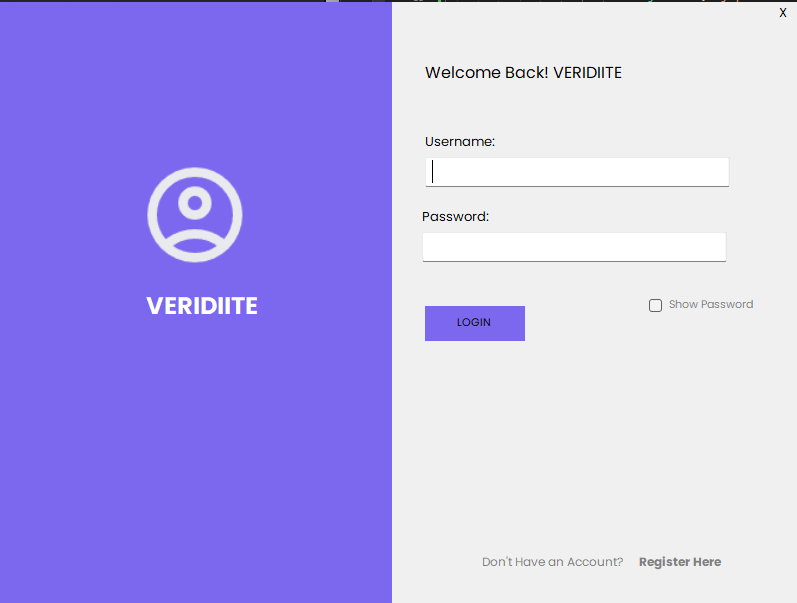
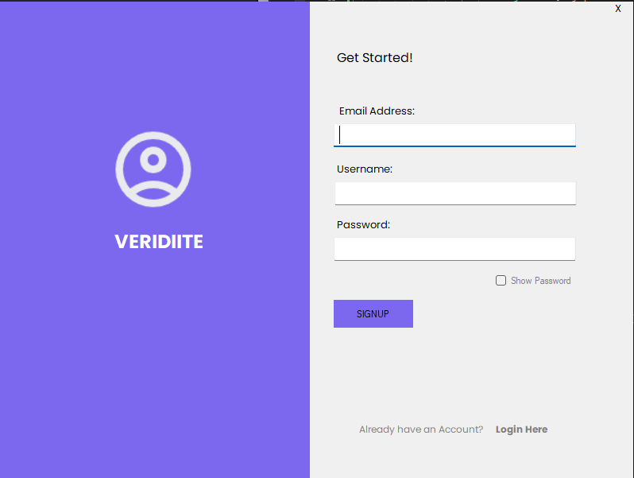

# **WinForms Login & Registration with SQL Database**

Welcome to the **WinForms-LoginReg-SQL** repository! 🚀 This project demonstrates how to create a **C# Windows Forms application** with **user authentication** using an **SQL database**.


---

## **📂 Folder Structure**  

```
WinForms-LoginReg-SQL/
├── LoginForm/            # Windows Forms login UI
├── RegistrationForm/      # User registration UI
├── Database/             # SQL scripts and database setup
├── README.md             # Project documentation
```

---

## **🛠 Features**  

✔ **User Registration** – Securely store user credentials in an SQL database.  
✔ **User Login** – Authenticate users with hashed passwords.  
✔ **SQL Integration** – Uses SQL Server for database storage.  
✔ **WinForms UI** – Simple, user-friendly interface for authentication.  
✔ **Error Handling** – Validation for incorrect login details, duplicate users, etc.  

---

## **📌 Technologies Used**  

- **C# (.NET Framework/.NET Core)**  
- **Windows Forms (WinForms)**  
- **SQL Server**  
- **Entity Framework (Optional for ORM)**  

---

## **📖 How to Use**  

### **1️⃣ Clone the Repository**  

```bash
git clone https://github.com/YOUR_USERNAME/WinForms-LoginReg-SQL.git
cd WinForms-LoginReg-SQL
---

## **👨‍💻 Author**  

👤 **Kasam Ali Aftab**  
💼 **Software Engineer**  
📎 [LinkedIn Profile](#)  

Feel free to connect with me for collaboration or feedback!  

---

### 🚀 Happy Coding!  
